# 국내 전기차 뉴스 시장 영향 분류

네이버 뉴스 검색 API로 수집한 한국어 전기차 뉴스의 제목과 요약문을 바탕으로,
뉴스가 **국내 전기차 시장 전체**의 수요·보급·등록대수에 미칠 예상 영향을
`긍정`, `중립`, `부정`으로 분류하는 학습 프로젝트입니다.

이 저장소는 과거 회사 데이터나 결과를 복원한 것이 아니라,
**공개 데이터 기반으로 뉴스 분류 방법론을 재구현한 프로젝트**입니다.

## 현재 상태

데이터 수집부터 전처리, 초기 모델 비교, 오분류 분석과 프롬프트 v2 작성까지 진행한 뒤,
정답 데이터 35건의 수동 라벨 재검토를 완료했습니다.

- 완료: 1차 수집·전처리, 초기 모델 비교, 35건 라벨 재검토, 프롬프트 v2 작성, 평가 split 처리 오류 수정
- 현재 한계: dev에 부정 라벨이 없어 현재 데이터로 3개 클래스 성능을 대표성 있게 평가하기 어려움
- 평가 방침: 기존 `final_test`는 이미 내용을 확인했고 사건 중복과 검색어 편향이 있어 최종 블라인드 테스트로 사용하지 않음
- 다음 코드 작업: split·부분 실행별 평가 결과 파일 덮어쓰기 방지
- 이후 작업: 새 평가 데이터에서 모델 재평가 후 프롬프트 v2 비교

## 분류 기준

이 프로젝트의 감성은 문장의 일반적인 분위기가 아닙니다.
뉴스가 국내 전기차 시장의 수요, 보급, 소비자 신뢰, 등록대수에 미칠 영향을 뜻합니다.

| 라벨 | 기준 |
| --- | --- |
| 긍정 | 수요·보급·등록 증가 가능성을 높이는 내용 |
| 중립 | 사실 전달이거나 영향이 불명확하고, 긍정·부정 요소가 혼재된 내용 |
| 부정 | 수요·보급·등록 감소 또는 위험 증가 가능성을 높이는 내용 |

자세한 경계 사례는 [라벨 가이드](docs/label_guide.md)에서 확인할 수 있습니다.

## 진행 흐름

```mermaid
flowchart LR
    A[라벨 정의] --> B[네이버 API 연결]
    B --> C[뉴스 수집]
    C --> D[전처리·중복 제거]
    D --> E[사람 정답 라벨]
    E --> F[규칙 모델]
    F --> G[Qwen·OpenAI 비교]
    G --> H[초기 평가·오류 분석]
    H --> I[35건 라벨 재검토]
    I --> J[평가 데이터 재설계]
    J --> K[모델 재평가]
    K -. 예정 .-> L[프롬프트 개선·최종 평가]
    L -. 장기 .-> M[월별 지수]
```



## 단계별 기록

| 단계 | 내용 | 문서 | 상태 |
| --- | --- | --- | --- |
| 1 | 문제 범위와 긍정·중립·부정 정의 | [라벨 가이드](docs/label_guide.md) | 완료 |
| 2 | 네이버 API 키 설정과 10건 연결 확인 | [API 연결](docs/step2_api_connection.md) | 완료 |
| 3 | 검색어 6개로 뉴스 60건 수집 | [수집 계획](docs/step3_collection_plan.md) | 완료 |
| 4 | HTML 제거, 날짜 통일, 링크 기준 중복 제거 | [전처리](docs/step4_preprocessing.md) | 완료 |
| 5 | 사람 정답 35건 작성·재검토, 기존 split 한계 확인 | [정답 라벨](docs/step5_human_labels.md) | 완료 |
| 6 | 키워드 규칙 기반 기준 모델 평가 | [기준 모델](docs/step6_baseline_model.md) | 초기 실험 완료 |
| 7 | 로컬 모델과 OpenAI API 분류 | [모델 선택](docs/step7_model_selection.md) | 초기 실험 완료 |
| 8 | Accuracy, Macro-F1, 클래스별 지표 비교 | [평가](docs/step8_evaluation.md) | 초기 실험 완료 |
| 9 | 오분류 유형화와 프롬프트 v2 작성 | [오류 분석](docs/step9_error_analysis.md) | v2 작성, 미실행 |
| 10 | 월별 감성 지수 산출 | AGENTS.md 10단계 | 미진행 |

라벨 재검토 전 과정과 결과는 [초기 실험 PDF 보고서](reports/project_report_ev_news_sentiment.pdf)에서도 확인할 수 있습니다.

## 라벨 재검토 전 1차 실험 결과

아래 수치는 라벨 재검토 전 `dev` 28건으로 계산한 초기 실험 결과이며,
현재 `gold_label` 기준 성능이나 모델 선택 결론으로 사용하지 않습니다.
Qwen의 Accuracy와 Macro-F1은 분류에 성공한 24건을 기준으로 계산됐으며,
별도로 4건의 출력 파싱 실패가 있었습니다.

| 모델 | 평가 건수 | 분류 실패 | Accuracy | Macro-F1 |
| --- | ---: | ---: | ---: | ---: |
| 키워드 규칙 모델 | 28 | 0 | 0.429 | 0.263 |
| Qwen2.5-1.5B-Instruct | 24 | 4 | 0.292 | 0.381 |
| OpenAI API, 프롬프트 v1 | 28 | 0 | 0.643 | 0.653 |

OpenAI API 모델은 가장 높은 점수를 보였지만 긍정 기사 21건 중 9건을 중립으로
판단했습니다. 이 오류를 바탕으로 구매·이용 조건 개선과 안전·충전 인프라 개선을
긍정 후보로 더 명확히 설명한 프롬프트 v2를 작성했습니다. v2의 실제 비교 평가는
아직 실행하지 않았습니다.

## 프로젝트 구조

```text
.
|-- AGENTS.md              # 프로젝트 목표와 협업·보안 규칙
|-- README.md              # 프로젝트 소개와 재현 방법
|-- pyproject.toml         # uv 프로젝트 및 의존성 정의
|-- uv.lock                # 고정된 의존성 버전
|-- data/
|   |-- labels/            # 사람이 작성한 정답 데이터
|   |-- predictions/       # 모델별 예측 결과
|   |-- raw/               # API 원본 응답, Git 제외
|   `-- processed/         # 전처리 결과, Git 제외
|-- docs/                  # 단계별 학습 기록
|-- reports/               # 평가, 오류 분석, PDF 보고서
`-- src/                   # 수집·전처리·분류·평가 코드
```

`data/raw/`, `data/processed/`, `data/cache/`는 생성 데이터이므로 Git에서 제외됩니다.
공개 저장소에는 사람이 작성한 라벨, 모델 예측, 평가 결과만 포함합니다.

## 실행 환경

- Python 3.11 이상, 3.14 미만
- [uv](https://docs.astral.sh/uv/)
- 네이버 뉴스 검색 API 계정
- OpenAI 분류를 실행할 경우 OpenAI API 키와 사용 요금
- Qwen 실행 시 충분한 메모리, GPU는 선택 사항

기본 환경은 다음 명령으로 설치합니다.

```powershell
uv sync
```

Qwen 등 로컬 모델까지 실행하려면 선택 의존성을 추가로 설치합니다.

```powershell
uv sync --extra local-models
```

로컬 모델 의존성은 용량이 크고, GPU 드라이버와 PyTorch 조합에 따라 CPU로 실행될 수 있습니다.

## 환경변수 설정

PowerShell에서 예제 파일을 복사합니다.

```powershell
Copy-Item .env.example .env
```

`.env`에 본인의 키를 입력합니다. 값에 공백이나 `#`가 없다면 따옴표는 필요하지 않습니다.

```dotenv
NAVER_CLIENT_ID=
NAVER_CLIENT_SECRET=
OPENAI_API_KEY=
OPENAI_MODEL=gpt-5.6-luna
```

`.env`는 Git에서 제외되며 실제 키를 코드, 문서, 이슈에 올리면 안 됩니다.

## 실행 순서

API 연결과 수집:

```powershell
uv run python src/check_naver_api.py
uv run python src/collect_news_sample.py
```

전처리와 라벨링 파일 생성:

```powershell
uv run python src/preprocess_news.py
uv run python src/create_labeling_dataset.py
uv run python src/validate_labels.py
```

현재 전처리·라벨링 스크립트의 입력 파일명에는 1차 실험 날짜인 `20260803`이
고정돼 있습니다. 새 날짜로 수집할 때는 해당 상수를 함께 변경해야 하며,
날짜를 명령행 인자로 받도록 개선하는 작업은 후속 과제입니다.

기준 모델과 Qwen 실행:

```powershell
uv run python src/rule_based_baseline.py
uv run python src/qwen_local_classifier.py --split dev --limit 3
```

OpenAI API는 기본적으로 dry-run이며 실제 비용이 발생하지 않습니다.

```powershell
uv run python src/openai_gpt_classifier.py --split dev --limit 3
```

실제 호출은 예상 비용과 계정 한도를 확인한 뒤 `--run`을 붙입니다.

```powershell
uv run python src/openai_gpt_classifier.py --run --split dev --limit 3 --prompt-version v1 --max-krw 10000
```

오분류 분석:

```powershell
uv run python src/analyze_misclassifications.py
```

## 데이터와 평가 한계

- 네이버 뉴스 검색 API의 제목과 요약문만 사용하며 기사 본문은 크롤링하지 않습니다.
- 현재 정답 데이터는 총 35건이며 모두 2026-08-03의 짧은 수집 구간에 속합니다.
- dev 28건은 긍정 11건, 중립 17건, 부정 0건입니다. 부정 사례가 없어 현재 데이터는 3개 클래스 평가에 적합하지 않습니다.
- 기존 final_test 7건은 긍정 0건, 중립 6건, 부정 1건입니다.
- 기존 final_test는 이미 수동 검토했고 dev와 같은 사건의 유사 기사가 섞여 있으며 특정 검색어에 치우쳐, 최종 블라인드 테스트로 사용하지 않습니다.
- 사람 라벨은 한 명이 작성했으므로 라벨 기준에 주관이 포함될 수 있습니다.
- OpenAI 비용은 코드에 둔 단가와 환율을 이용한 추정치이며 실제 청구액과 다를 수 있습니다.
- 기존 모델 성능은 라벨 재검토 전 정답을 사용한 초기 결과이며, 현재 성능으로 해석하면 안 됩니다.
- 프롬프트 v2는 작성했지만 아직 실행하지 않았습니다.

## 다음 작업

1. split·부분 실행별 평가 결과 파일 덮어쓰기 방지
2. 긍정·중립·부정 사례를 다양하게 포함하도록 새 데이터를 수집하고 평가셋 설계
3. 같은 사건의 유사 기사가 split 사이에 섞이지 않도록 분리 방식 개선
4. 새 평가셋에서 기존 모델 재평가
5. 재평가 후 프롬프트 v1과 v2 비교
6. 날짜 하드코딩과 실행 인자를 정리하고, 장기적으로 월별 감성 지수 생성

## 데이터 출처

- [네이버 뉴스 검색 API 문서](https://developers.naver.com/docs/serviceapi/search/news/news.md)
- [네이버 개발자 애플리케이션 등록](https://developers.naver.com/apps/#/register)
